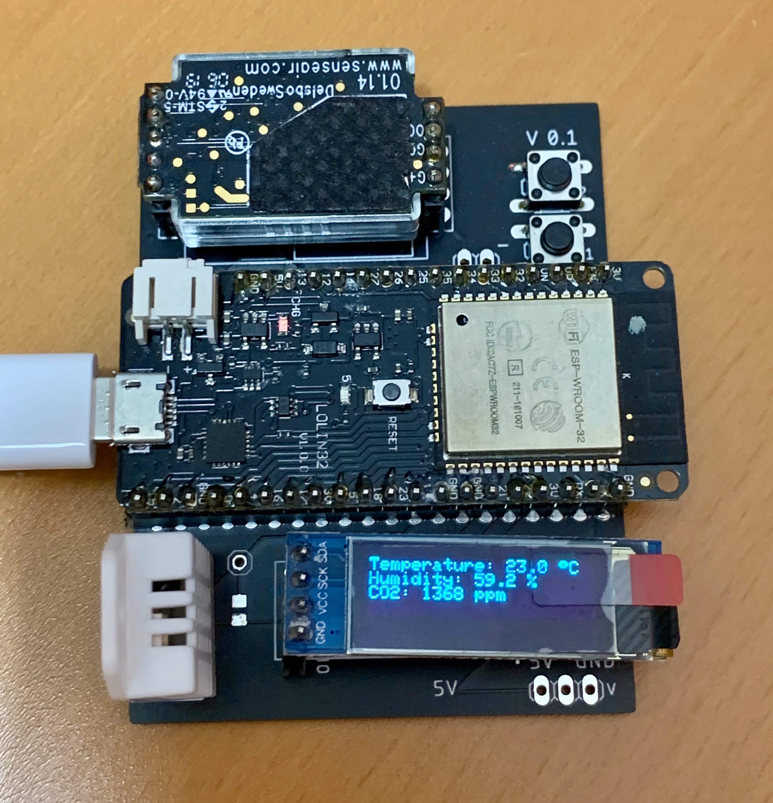

# Project Aether Microcontroller

Measure the air quality with an microcontroller.

This project measures the air quality with a microcontroller, the data is sent via MQTT to a Mosquitto Broker.

# Requirements

- Editor, eg. VS Code 
- PlatformIO, Plugin or CLI tool

# Build and Run

1. `cp src/config.template.h src/config.h`
2. Set the correct variables in `src/config.h`
3. Compile and upload the code to the microcontroller via PlatformIO
    ```shell
    # Build
    $ platformio run --environment lolin_d32
    # Build + Upload + Monitor
    $ platformio run --target upload --target monitor --environment lolin_d32
    ```


# Hardware Components



|Type|Description|Model|
|---|---|---|
|Microcontroller|Brain|Wemos Lolin D32 ESP32|
|Sensor|Temperature & Humidity |DHT22 (ASAIR AM2302)|
|Sensor|CO2|SenseAir S8 LP|
|Output|Display|128x32 Pixel, Black/White, OLED|
|Input|Button|generic button|

